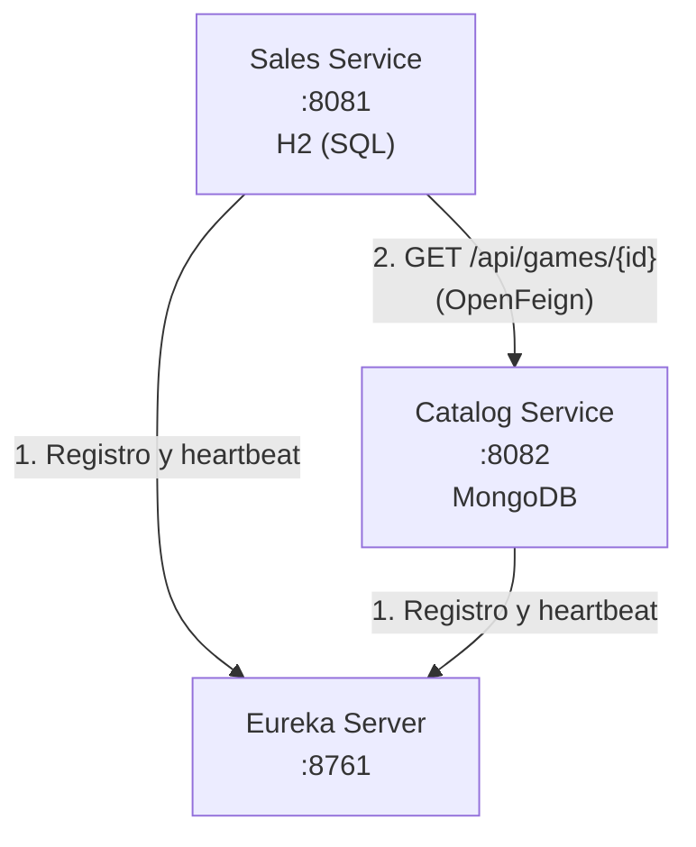
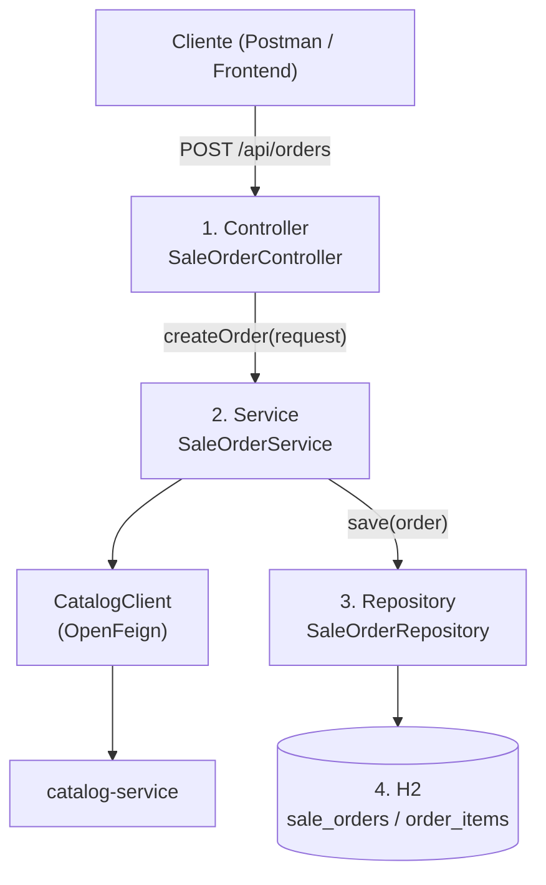
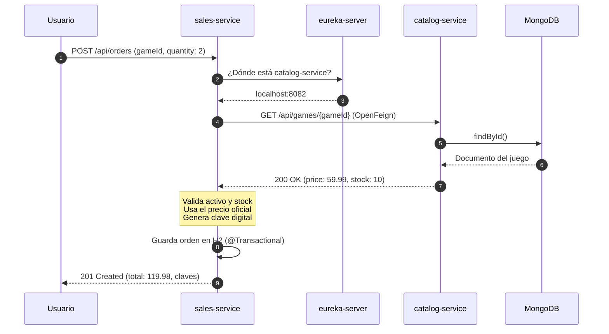
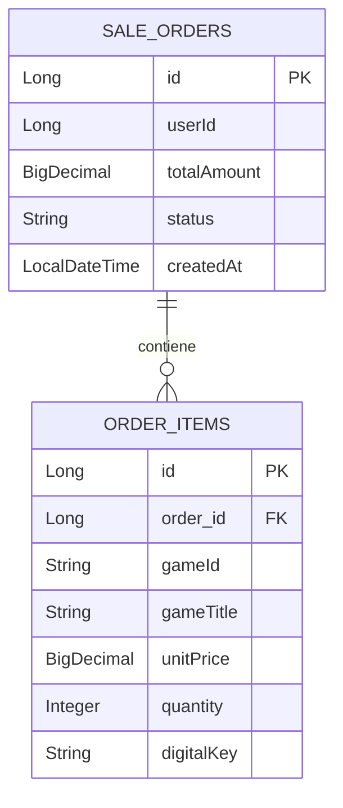

# Sales Service

> Microservicio de **ventas, órdenes de compra y generación de claves digitales** para una tienda de videojuegos, construido sobre una arquitectura de microservicios con Spring Cloud.


---

## Tabla de contenido

1. [Resumen del proyecto](#1-resumen-del-proyecto)
2. [Stack tecnológico y por qué se eligió](#2-stack-tecnológico-y-por-qué-se-eligió)
3. [Ecosistema de microservicios](#3-ecosistema-de-microservicios)
4. [Decisiones de arquitectura](#4-decisiones-de-arquitectura)
5. [Arquitectura interna por capas](#5-arquitectura-interna-por-capas)
6. [Flujo de una compra, paso a paso](#6-flujo-de-una-compra-paso-a-paso)
7. [Estructura del proyecto](#7-estructura-del-proyecto)
8. [Modelo de datos](#8-modelo-de-datos)
9. [Referencia de la API](#9-referencia-de-la-api)
10. [Manejo de errores](#10-manejo-de-errores)
11. [Configuración](#11-configuración)
12. [Instalación y ejecución](#12-instalación-y-ejecución)
13. [Guía de pruebas](#13-guía-de-pruebas)
14. [Solución de problemas](#14-solución-de-problemas)
15. [Mejoras futuras](#15-mejoras-futuras)

---

## 1. Resumen del proyecto

`sales-service` es el microservicio responsable de todo lo que ocurre **desde que un usuario decide comprar** hasta que recibe su clave digital:

| Responsabilidad | Descripción |
|---|---|
| Registro de órdenes | Crea y almacena órdenes de compra con sus artículos. |
| Validación contra el catálogo | Consulta a `catalog-service` para confirmar que el juego existe, está activo y tiene stock. |
| Cálculo seguro del total | Calcula el monto usando el **precio oficial del catálogo**, nunca el que envía el cliente. |
| Generación de claves digitales | Emite una clave por compra (formato `STEAM-XXXX`). |
| Consulta y administración | Lista, busca, actualiza y elimina órdenes. |

**¿Por qué existe como servicio independiente?** Las ventas tienen un ritmo de carga, reglas de negocio y requisitos de consistencia distintos a los del catálogo. Separarlas permite escalarlas, desplegarlas y mantenerlas sin afectar al resto del sistema.

---

## 2. Stack tecnológico y por qué se eligió

| Tecnología | Versión | Función | ¿Por qué se usa? |
|---|---|---|---|
| Java | 17 | Lenguaje | Versión LTS con soporte de `record`, ideal para DTOs inmutables. |
| Spring Boot | 4.1.1 | Framework base | Configuración automática y servidor embebido: menos código repetitivo. |
| Spring Data JPA | (BOM de Boot) | Persistencia | Genera consultas SQL a partir de interfaces, evitando JDBC manual. |
| H2 Database | (BOM de Boot) | Base de datos SQL en memoria | Cero instalación; perfecta para desarrollo y demos. |
| Spring Cloud Netflix Eureka Client | 2025.1.3 | Descubrimiento de servicios | Permite localizar otros servicios por nombre, sin IPs fijas. |
| Spring Cloud OpenFeign | 2025.1.3 | Cliente HTTP declarativo | Se consume otra API escribiendo solo una interfaz. |
| Spring Cloud Config Client | 2025.1.3 | Configuración centralizada | Preparado para externalizar propiedades. |
| Spring Kafka | (BOM de Boot) | Mensajería asíncrona | Preparado para publicar eventos (ver [mejoras futuras](#15-mejoras-futuras)). |
| Bean Validation | (BOM de Boot) | Validación de entrada | Rechaza datos inválidos antes de llegar a la lógica de negocio. |
| Lombok | (BOM de Boot) | Reducción de código repetitivo | Genera getters, setters y constructores en tiempo de compilación. |
| Maven Wrapper | — | Construcción | Cualquiera compila con la misma versión de Maven, sin instalarla. |

> **Nota sobre versiones:** las versiones de Spring Boot y Spring Cloud se definen en el `pom.xml`. Spring Cloud se importa mediante un BOM (`dependencyManagement`) para garantizar que todas sus librerías sean compatibles entre sí.

---

## 3. Ecosistema de microservicios

Este servicio es una pieza de un sistema distribuido formado por tres repositorios:

| Servicio | Puerto | Base de datos | Rol | Repositorio |
|---|---|---|---|---|
| `eureka-server` | 8761 | — | Directorio de servicios (Service Discovery) | [Alger125/eureka-server](https://github.com/Alger125/eureka-server) |
| `catalog-service` | 8082 | MongoDB | Catálogo e inventario de videojuegos | [Alger125/catalog-service](https://github.com/Alger125/catalog-service) |
| `sales-service` | 8081 | H2 (SQL) | Ventas y facturación | *(este repositorio)* |

### Diagrama de comunicación



**Cómo leerlo:** ambos servicios se registran en Eureka al arrancar. Cuando `sales-service` necesita datos de un juego, le pregunta a Eureka dónde vive `catalog-service` y le hace la petición HTTP.

---

## 4. Decisiones de arquitectura

Esta sección explica **el porqué** de las decisiones más importantes.

### 4.1 Base de datos propia por servicio (*Database-per-Service*)

- `sales-service` tiene su propia base de datos. Ningún otro servicio accede directamente a sus tablas.
- **Por qué:** si el catálogo se cae o está en mantenimiento, las ventas y su almacenamiento siguen funcionando. Además, cada equipo puede cambiar su esquema sin coordinarse con los demás.

### 4.2 SQL para ventas, NoSQL para catálogo

- **Ventas → SQL (H2/JPA):** manejan dinero y requieren propiedades **ACID** (Atomicidad, Consistencia, Aislamiento, Durabilidad). Una orden y sus artículos deben guardarse completos o no guardarse.
- **Catálogo → MongoDB:** los juegos tienen atributos variables (plataformas, géneros, etc.) y se adaptan bien a documentos flexibles.

### 4.3 Escalabilidad independiente

En temporadas de alta demanda las compras pueden multiplicarse mientras el catálogo casi no cambia. Al estar separados, se pueden levantar varias instancias de `sales-service` sin gastar recursos en el catálogo.

### 4.4 Descubrimiento de servicios (Eureka) en lugar de direcciones fijas

- `sales-service` **no** conoce la dirección de `catalog-service`; solo conoce su nombre lógico.
- **Por qué:** las direcciones cambian (contenedores, nuevas instancias, distintos entornos). Con Eureka, si hay tres instancias de catálogo, el balanceador de carga reparte el tráfico entre ellas automáticamente.

### 4.5 OpenFeign en lugar de `RestTemplate` o `WebClient`

- Se declara una interfaz y Spring genera la implementación HTTP.
- **Por qué:** menos código, más legible, y se integra de forma nativa con Eureka y el balanceo de carga.

### 4.6 Blindaje de precios (anti-fraude)

- El cliente puede enviar un `unitPrice`, pero el servidor **lo ignora** y usa el precio que devuelve `catalog-service`.
- **Por qué:** si el backend confiara en el precio del cliente, cualquiera podría comprar un juego de 59.99 por 0.01 alterando la petición. La fuente de verdad del precio es el catálogo.

### 4.7 DTOs separados de las entidades

- Las entidades (`SaleOrder`, `OrderItem`) representan la base de datos; los DTOs (`SaleOrderRequest`, `GameResponse`…) representan lo que entra y sale de la API.
- **Por qué:** se evita exponer la estructura interna y se controla exactamente qué datos puede enviar el cliente (por ejemplo, el `totalAmount` **no** se acepta desde afuera).

---

## 5. Arquitectura interna por capas



| Capa | Clase | Responsabilidad | Por qué está separada |
|---|---|---|---|
| Controller | `SaleOrderController` | Recibe HTTP, valida estructura (`@Valid`), delega. | Solo "habla HTTP"; no contiene reglas de negocio. |
| Service | `SaleOrderService` | Reglas de negocio, cálculo de montos, llamadas a Feign, transacciones. | La lógica se puede probar sin levantar un servidor web. |
| Repository | `SaleOrderRepository` | Acceso a datos con Spring Data JPA. | Aísla el SQL del resto del código. |
| Client | `CatalogClient` | Contrato HTTP hacia `catalog-service`. | Si el catálogo cambia, solo se toca este punto. |

---

## 6. Flujo de una compra, paso a paso

Este es el recorrido completo cuando un usuario compra 2 unidades de *Elden Ring*:



### Explicación de cada paso

| # | Paso | Qué ocurre | Por qué |
|---|---|---|---|
| 1 | Petición del usuario | Llega un `POST /api/orders` con `userId` e `items`. | Punto de entrada de la API. |
| 2 | Validación estructural | `@Valid` revisa que los campos requeridos estén presentes y sean correctos. | Falla rápido y barato, antes de consultar servicios externos. |
| 3 | Resolución del servicio | Feign pregunta a Eureka por `catalog-service`. | Evita direcciones fijas. |
| 4 | Consulta al catálogo | Por cada artículo se hace `GET /api/games/{id}`. | Se necesita precio, stock y estado **reales y actuales**. |
| 5 | Validación de negocio | Se verifica que el juego exista, esté activo y que `stock >= quantity`. | Impide vender lo que no se puede entregar. |
| 6 | Cálculo del total | `precio oficial × cantidad`, sumado con `BigDecimal`. | `BigDecimal` evita los errores de redondeo de `double` en dinero. |
| 7 | Clave digital | Se genera una clave con formato `STEAM-XXXX` (basada en UUID). | Entrega el producto digital al comprador. |
| 8 | Persistencia | Se guarda la orden y sus artículos en una sola transacción. | `@Transactional` garantiza todo-o-nada. |
| 9 | Respuesta | Se devuelve `201 Created` con la orden en estado `PENDING`. | Confirma al cliente el resultado. |

---

## 7. Estructura del proyecto

```
sales-service/
├── .mvn/wrapper/                    # Maven Wrapper (compilar sin instalar Maven)
├── src/
│   ├── main/
│   │   ├── java/com/jonathan/gamestore/sales/
│   │   │   ├── SalesServiceApplication.java
│   │   │   ├── client/       CatalogClient.java
│   │   │   ├── config/       H2Config.java
│   │   │   ├── controller/   SaleOrderController.java
│   │   │   ├── dto/          SaleOrderRequest, OrderItemRequest, GameResponse
│   │   │   ├── exception/    ErrorResponse, GlobalExceptionHandler
│   │   │   ├── model/        SaleOrder, OrderItem, OrderStatus
│   │   │   ├── repository/   SaleOrderRepository.java
│   │   │   └── service/      SaleOrderService.java
│   │   └── resources/        application.properties
│   └── test/                 # Pruebas
├── mvnw / mvnw.cmd          # Scripts del Maven Wrapper (Linux-Mac / Windows)
├── pom.xml                  # Dependencias y configuración de construcción
└── README.md
```

### Descripción de cada componente

| Componente | Descripción |
|---|---|
| `SalesServiceApplication` | Punto de entrada. Activa `@EnableDiscoveryClient` (registro en Eureka) y `@EnableFeignClients` (clientes declarativos). |
| `CatalogClient` | Interfaz Feign con `@FeignClient(name = "catalog-service")` que expone `getGameById(id)`. |
| `H2Config` | Registra el servlet de la consola web de H2 en `/h2-console`. |
| `SaleOrderController` | API REST bajo `/api/orders`. |
| `SaleOrderService` | Orquesta validaciones, cálculo de montos, generación de claves y persistencia. |
| `SaleOrderRepository` | `JpaRepository<SaleOrder, Long>` con consultas derivadas como `findByUserId`. |
| `SaleOrderRequest` / `OrderItemRequest` | Records de entrada. El request **no** incluye `totalAmount` por seguridad. |
| `GameResponse` | Record que replica el JSON que devuelve `catalog-service`. Existe porque este servicio no comparte clases con el catálogo. |
| `ErrorResponse` | Estructura estándar de error (`status`, `error`, `message`, `validationErrors`, `timestamp`). |
| `GlobalExceptionHandler` | `@RestControllerAdvice` que convierte excepciones en respuestas HTTP coherentes. |
| `OrderStatus` | Enum de estados: `PENDING`, `COMPLETED`, `CANCELLED`. |

---

## 8. Modelo de datos



**Decisiones relevantes:**

- `gameId` es `String` porque los identificadores de MongoDB (`ObjectId`) son cadenas de 24 caracteres. **No hay clave foránea hacia el catálogo**, porque vive en otra base de datos.
- `gameTitle` y `unitPrice` se **guardan dentro del ítem** (desnormalización intencional): así la orden conserva el precio y nombre del momento de la compra, aunque el catálogo cambie después.
- La relación `@OneToMany(cascade = ALL, orphanRemoval = true)` hace que guardar o borrar una orden afecte también a sus artículos.

---

## 9. Referencia de la API

**URL base:** `http://localhost:8081/api/orders`

| Operación | Método | Ruta | Descripción | Éxito | Errores |
|---|---|---|---|---|---|
| Crear | `POST` | `/api/orders` | Crea una orden validando precio y stock en el catálogo. | `201` | `400`, `404` |
| Listar | `GET` | `/api/orders` | Devuelve todas las órdenes. | `200` | `500` |
| Consultar | `GET` | `/api/orders/{id}` | Devuelve una orden por ID. | `200` | `404` |
| Por usuario | `GET` | `/api/orders/user/{userId}` | Devuelve las órdenes de un usuario. | `200` | — |
| Actualizar | `PUT` | `/api/orders/{id}` | Actualiza una orden recalculando montos contra el catálogo. | `200` | `400`, `404` |
| Eliminar | `DELETE` | `/api/orders/{id}` | Elimina la orden y sus artículos en cascada. | `204` | `404` |

### Ejemplo: crear una orden

**Petición**

```http
POST /api/orders
Content-Type: application/json

{
  "userId": 101,
  "items": [
    {
      "gameId": "650c1f1e9b1d8b2bad000001",
      "gameTitle": "Elden Ring",
      "unitPrice": 59.99,
      "quantity": 2
    }
  ]
}
```

**Respuesta `201 Created`** *(ilustrativa; los nombres exactos pueden variar según la entidad)*

```json
{
  "id": 1,
  "userId": 101,
  "totalAmount": 119.98,
  "status": "PENDING",
  "createdAt": "2026-09-30T10:15:00",
  "items": [
    {
      "gameId": "650c1f1e9b1d8b2bad000001",
      "gameTitle": "Elden Ring",
      "unitPrice": 59.99,
      "quantity": 2,
      "digitalKey": "STEAM-A8F2-4B1C-..."
    }
  ]
}
```

---

## 10. Manejo de errores

`GlobalExceptionHandler` centraliza los errores para que **todas** las respuestas de fallo tengan el mismo formato.

| Situación | Excepción capturada | HTTP | Ejemplo de causa |
|---|---|---|---|
| Datos de entrada inválidos | `MethodArgumentNotValidException` | 400 | Falta `userId` o `quantity` es negativa. |
| Regla de negocio incumplida | `IllegalArgumentException` | 400 | "Stock insuficiente", "Videojuego inactivo o inexistente". |
| Juego no encontrado en catálogo | Error 404 de Feign | 404 | `gameId` inexistente. |

**Formato estándar de error**

```json
{
  "status": 400,
  "error": "Bad Request",
  "message": "Stock insuficiente para: Elden Ring",
  "validationErrors": null,
  "timestamp": "2026-09-30T10:15:00"
}
```

**Por qué centralizarlo:** el cliente siempre sabe qué estructura esperar, y los controladores se mantienen limpios, sin bloques `try/catch`.

---

## 11. Configuración

Archivo: `src/main/resources/application.properties`

```properties
spring.application.name=sales-service
server.port=8081
eureka.client.service-url.defaultZone=http://localhost:8761/eureka/
```

| Propiedad | Valor | Para qué sirve |
|---|---|---|
| `spring.application.name` | `sales-service` | Nombre con el que se registra en Eureka. Otros servicios lo usan para encontrarlo. |
| `server.port` | `8081` | Puerto HTTP del servicio. |
| `eureka.client.service-url.defaultZone` | `http://localhost:8761/eureka/` | Dirección del servidor Eureka. |

**Base de datos H2**

| Parámetro | Valor |
|---|---|
| Consola | `http://localhost:8081/h2-console` |
| JDBC URL | `jdbc:h2:mem:salesdb` |

> ⚠️ H2 es **en memoria**: los datos se pierden al reiniciar el servicio. Es intencional para desarrollo; para producción debe reemplazarse por PostgreSQL, MySQL u otro motor persistente.

---

## 12. Instalación y ejecución

### Requisitos previos

| Requisito | Versión | Verificación |
|---|---|---|
| JDK | 17 o superior | `java -version` |
| Git | Cualquiera reciente | `git --version` |
| Maven | No necesario (se usa el wrapper) | — |

### Orden de arranque (importante)

Los servicios **deben iniciarse en este orden**:

1. **`eureka-server`**: es el directorio; si no existe, los demás no pueden registrarse.
2. **`catalog-service`**: debe estar disponible para que las ventas puedan validar juegos.
3. **`sales-service`**: depende de los dos anteriores.

### Paso 1. Clonar el repositorio

```bash
git clone https://github.com/Alger125/sales-service.git
cd sales-service
```

### Paso 2. Iniciar Eureka Server

```bash
cd ../eureka-server
./mvnw spring-boot:run          # Windows: .\mvnw.cmd spring-boot:run
```

**Verificar:** abrir `http://localhost:8761` y ver el panel de Eureka.

### Paso 3. Iniciar Catalog Service

```bash
cd ../catalog-service
./mvnw spring-boot:run
```

**Verificar:** `CATALOG-SERVICE` aparece en Eureka con estado `UP`. Requiere MongoDB disponible en el puerto `27017`.

### Paso 4. Iniciar Sales Service

```bash
cd ../sales-service
./mvnw spring-boot:run
```

**Verificar:** `SALES-SERVICE` aparece en Eureka con estado `UP`.

### Alternativa: ejecutar el JAR (equipos con poca RAM)

```bash
./mvnw clean package -DskipTests
java -Xmx300m -jar target/sales-service-0.0.1-SNAPSHOT.jar
```

- `-DskipTests` acelera la compilación omitiendo pruebas.
- `-Xmx300m` limita la memoria de la JVM a 300 MB, útil cuando se ejecutan varios servicios en una máquina de 8 GB.

---

## 13. Guía de pruebas

Los ejemplos usan **cURL** (Linux/macOS/Git Bash). Más abajo hay equivalentes en PowerShell.

### Escenario completo de extremo a extremo

**1. Crear un videojuego en el catálogo** (guarda el `id` devuelto)

```bash
curl -X POST http://localhost:8082/api/games \
  -H "Content-Type: application/json" \
  -d '{
    "title": "Elden Ring",
    "description": "Edición Estándar",
    "genre": "RPG",
    "price": 59.99,
    "stock": 10,
    "platforms": ["PC", "PS5"]
  }'
```

**2. Crear la orden de compra** (sustituir `GAME_ID`)

```bash
curl -X POST http://localhost:8081/api/orders \
  -H "Content-Type: application/json" \
  -d '{
    "userId": 101,
    "items": [
      { "gameId": "GAME_ID", "gameTitle": "Elden Ring", "unitPrice": 59.99, "quantity": 2 }
    ]
  }'
```

*Resultado esperado:* `201 Created`, total `119.98`, estado `PENDING` y claves digitales generadas.

**3. Consultas**

```bash
curl http://localhost:8081/api/orders              # todas
curl http://localhost:8081/api/orders/1            # por ID
curl http://localhost:8081/api/orders/user/101     # por usuario
```

**4. Eliminar**

```bash
curl -X DELETE http://localhost:8081/api/orders/1 -i
```

*Resultado esperado:* `204 No Content`.

### Pruebas de casos negativos (recomendadas)

| Caso | Cómo provocarlo | Resultado esperado |
|---|---|---|
| Stock insuficiente | `quantity` mayor al `stock` del juego | `400` con mensaje de stock |
| Juego inexistente | `gameId` que no existe | `404` |
| Validación | Enviar `items` vacío o sin `userId` | `400` con `validationErrors` |
| Manipulación de precio | Enviar `unitPrice: 0.01` | El total se calcula con el **precio oficial**, no con `0.01` |
| Catálogo caído | Detener `catalog-service` y crear orden | Error controlado (ver [mejoras futuras](#15-mejoras-futuras)) |

### Equivalente en PowerShell

```powershell
Invoke-RestMethod -Uri "http://localhost:8081/api/orders" -Method Post `
  -ContentType "application/json" `
  -Body '{"userId":101,"items":[{"gameId":"GAME_ID","gameTitle":"Elden Ring","unitPrice":59.99,"quantity":2}]}' |
  ConvertTo-Json -Depth 5
```

---

## 14. Solución de problemas

| Síntoma | Causa probable | Solución |
|---|---|---|
| `Connection refused` a `localhost:8761` | Eureka no está iniciado. | Iniciar `eureka-server` primero. |
| `Load balancer does not contain an instance for catalog-service` | `catalog-service` no se ha registrado aún. | Esperar unos segundos y revisar el panel de Eureka. |
| `404` al crear orden | El `gameId` no existe en MongoDB. | Crear el juego y usar el `id` devuelto. |
| Puerto `8081` ocupado | Otro proceso lo usa. | Cambiar `server.port` o cerrar el proceso. |
| Los datos desaparecen al reiniciar | H2 es en memoria. | Comportamiento esperado; usar una BD persistente si se requiere. |
| `OutOfMemoryError` | Poca memoria disponible. | Ajustar `-Xmx` o cerrar otras aplicaciones. |

---

## 15. Mejoras futuras

Puntos identificados que fortalecerían el servicio:

- **Resiliencia:** agregar *Circuit Breaker*, *timeouts* y *fallbacks* (por ejemplo con Resilience4j) para que una caída del catálogo no bloquee las ventas.
- **Descuento de stock:** definir cómo y cuándo se reduce el inventario tras una compra confirmada, y qué pasa si dos compras simultáneas piden la última unidad.
- **Mensajería asíncrona:** el `pom.xml` ya incluye Spring Kafka; puede usarse para publicar eventos como `OrderCreated` y desacoplar notificaciones o actualizaciones de inventario.
- **Configuración centralizada:** el cliente de Spring Cloud Config ya está incluido; falta conectarlo a un Config Server.
- **Persistencia real:** migrar de H2 a PostgreSQL/MySQL y agregar migraciones con Flyway o Liquibase.
- **Seguridad:** autenticación y autorización (JWT / OAuth2), para no depender de que el cliente indique su propio `userId`.
- **Documentación interactiva:** exponer la API con OpenAPI/Swagger.
- **Pruebas automatizadas:** pruebas unitarias del servicio (mockeando `CatalogClient`) y de integración.
- **Contenedores:** `Dockerfile` y `docker-compose.yml` para levantar todo el ecosistema con un solo comando.
- **Observabilidad:** logs estructurados, métricas con Actuator y trazabilidad distribuida.

---

## Autor

**Alger125** · [github.com/Alger125](https://github.com/Alger125)
