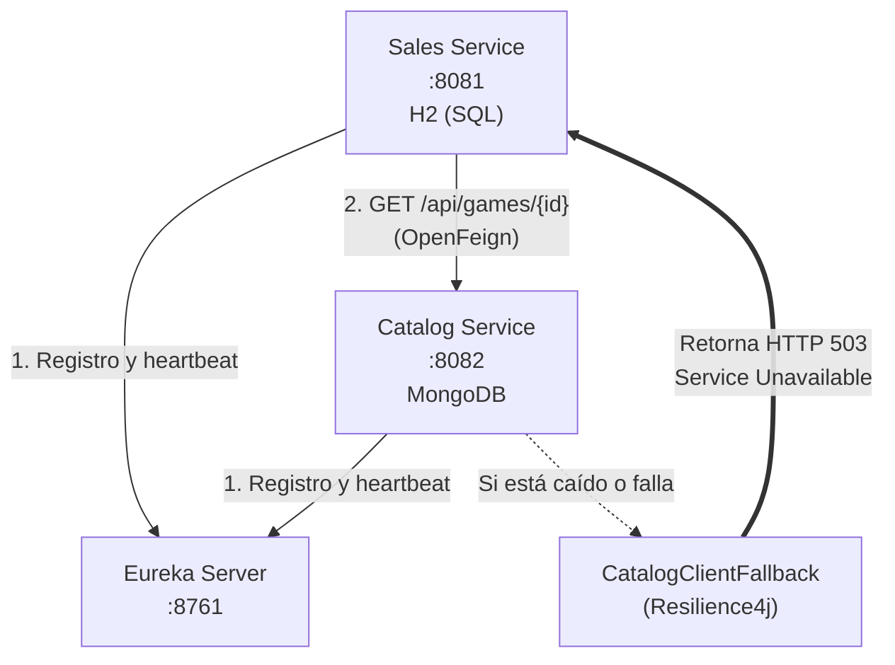
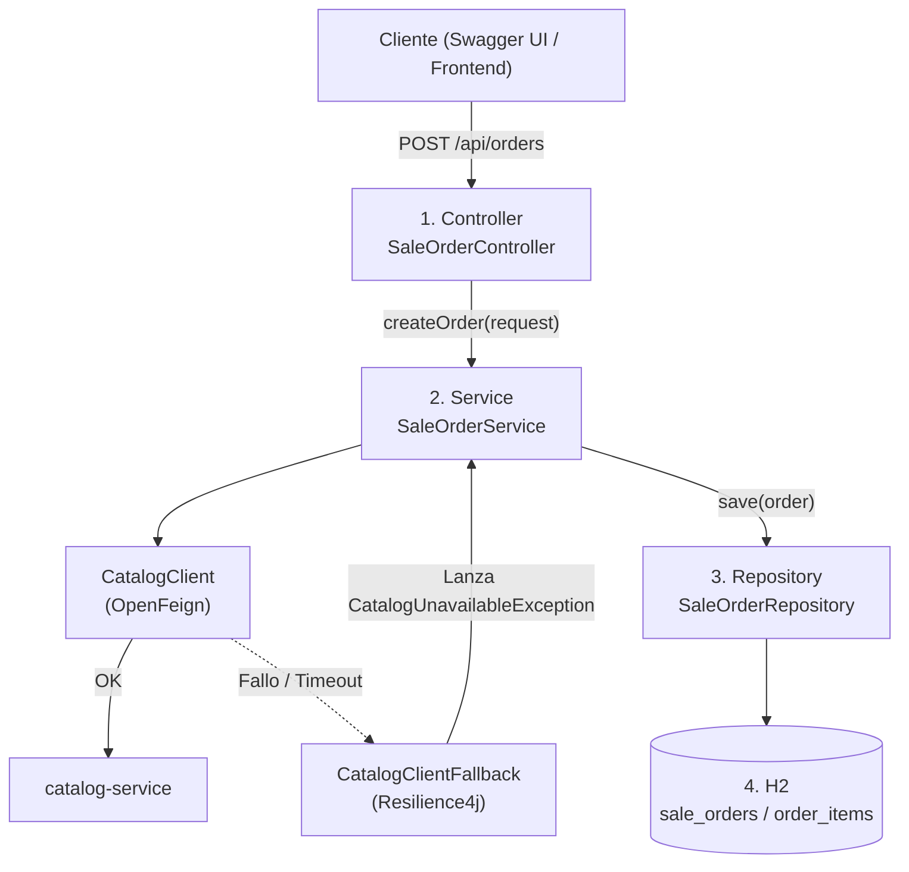
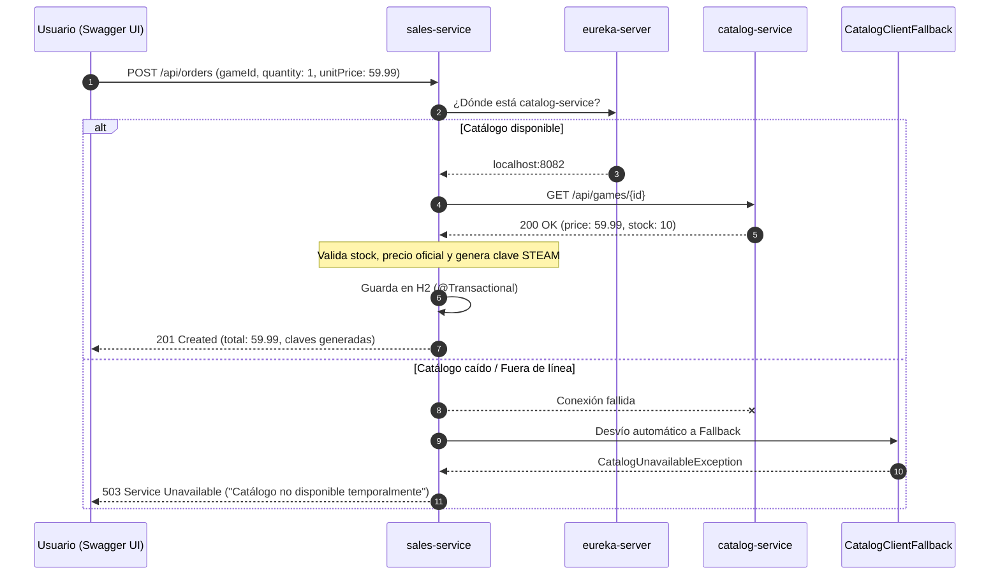
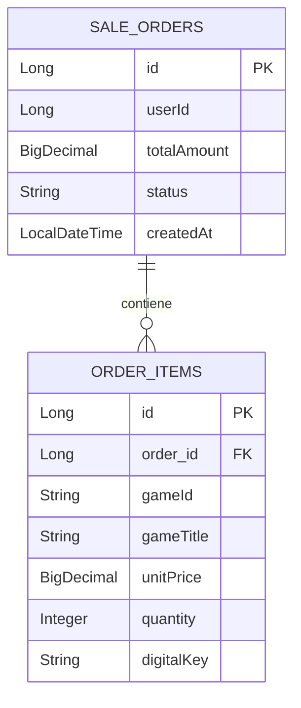

# Sales Service

> Microservicio de **ventas, órdenes de compra y generación de claves digitales** para una tienda de videojuegos, construido sobre una arquitectura de microservicios con Spring Cloud, protegido con Resilience4j y documentado interactivamente con Swagger / OpenAPI 3.


---

## Tabla de contenido

1. [Resumen del proyecto](#1-resumen-del-proyecto)
2. [Stack tecnológico y por qué se eligió](#2-stack-tecnológico-y-por-qué-se-eligió)
3. [Ecosistema de microservicios](#3-ecosistema-de-microservicios)
4. [Decisiones de arquitectura](#4-decisiones-de-arquitectura)
5. [Arquitectura interna por capas](#5-arquitectura-interna-por-capas)
6. [Flujo de una compra, paso a paso](#6-flujo-de-una-compra-paso-a-paso)
7. [Estructura del proyecto](#7-estructura-del-proyecto)
8. [Modelo de datos](#8-modelo-de-datos)
9. [Referencia de la API y Swagger UI](#9-referencia-de-la-api-y-swagger-ui)
10. [Manejo de errores](#10-manejo-de-errores)
11. [Configuración](#11-configuración)
12. [Instalación y ejecución](#12-instalación-y-ejecución)
13. [Guía de pruebas](#13-guía-de-pruebas)
14. [Solución de problemas](#14-solución-de-problemas)
15. [Mejoras futuras](#15-mejoras-futuras)

---

## 1. Resumen del proyecto

`sales-service` es el microservicio responsable de todo lo que ocurre **desde que un usuario decide comprar** hasta que recibe su clave digital:

| Responsabilidad | Descripción |
|---|---|
| Registro de órdenes | Crea y almacena órdenes de compra con sus artículos. |
| Validación contra el catálogo | Consulta a `catalog-service` para confirmar que el juego existe, está activo y tiene stock. |
| Cálculo seguro del total | Calcula el monto usando el **precio oficial del catálogo**, nunca el que envía el cliente. |
| Tolerancia a fallos | Aísla caídas del catálogo mediante Circuit Breaker y Fallback (HTTP 503 controlado). |
| Documentación interactiva | Expone interfaz visual Swagger UI para probar endpoints desde el navegador. |
| Generación de claves digitales | Emite una clave por compra (formato `STEAM-XXXX`). |
| Consulta y administración | Lista, busca, actualiza y elimina órdenes. |

**¿Por qué existe como servicio independiente?** Las ventas tienen un ritmo de carga, reglas de negocio y requisitos de consistencia distintos a los del catálogo. Separarlas permite escalarlas, desplegarlas y mantenerlas sin afectar al resto del sistema.

---

## 2. Stack tecnológico y por qué se eligió

| Tecnología | Versión | Función | ¿Por qué se usa? |
|---|---|---|---|
| Java | 17 | Lenguaje | Versión LTS con soporte de `record`, ideal para DTOs inmutables. |
| Spring Boot | 4.1.1 | Framework base | Configuración automática y servidor embebido: menos código repetitivo. |
| Spring Data JPA | (BOM de Boot) | Persistencia | Genera consultas SQL a partir de interfaces, evitando JDBC manual. |
| H2 Database | (BOM de Boot) | Base de datos SQL en memoria | Cero instalación; perfecta para desarrollo y demos. |
| Spring Cloud Netflix Eureka Client | 2025.1.3 | Descubrimiento de servicios | Permite localizar otros servicios por nombre, sin IPs fijas. |
| Spring Cloud OpenFeign | 2025.1.3 | Cliente HTTP declarativo | Se consume otra API escribiendo solo una interfaz. |
| Spring Cloud Circuit Breaker (Resilience4j) | 2025.1.3 | Tolerancia a fallos y resiliencia | Implementa el patrón Circuit Breaker y Fallback para aislar caídas de `catalog-service`. |
| Springdoc OpenAPI 3 (Swagger UI) | 2.8.5 | Documentación interactiva | Genera la UI en `/swagger-ui.html` para explorar y probar la API sin herramientas externas. |
| Spring Cloud Config Client | 2025.1.3 | Configuración centralizada | Preparado para externalizar propiedades. |
| Spring Kafka | (BOM de Boot) | Mensajería asíncrona | Preparado para publicar eventos (ver [mejoras futuras](#15-mejoras-futuras)). |
| Bean Validation | (BOM de Boot) | Validación de entrada | Rechaza datos inválidos antes de llegar a la lógica de negocio. |
| Lombok | (BOM de Boot) | Reducción de código repetitivo | Genera getters, setters y constructores en tiempo de compilación. |
| Maven Wrapper | — | Construcción | Cualquiera compila con la misma versión de Maven, sin instalarla. |

---

## 3. Ecosistema de microservicios

Este servicio es una pieza de un sistema distribuido formado por tres repositorios:

| Servicio | Puerto | Base de datos | Rol | Repositorio |
|---|---|---|---|---|
| `eureka-server` | 8761 | — | Directorio de servicios (Service Discovery) | [Alger125/eureka-server](https://github.com/Alger125/eureka-server) |
| `catalog-service` | 8082 | MongoDB | Catálogo e inventario de videojuegos | [Alger125/catalog-service](https://github.com/Alger125/catalog-service) |
| `sales-service` | 8081 | H2 (SQL) | Ventas y facturación | *(este repositorio)* |

### Diagrama de comunicación con Resiliencia



**Cómo leerlo:** ambos servicios se registran en Eureka. Cuando `sales-service` consulta a `catalog-service`, la petición pasa por el escudo de Resilience4j. Si el catálogo se cae o no responde, el Fallback devuelve una respuesta controlada 503 sin congelar las ventas.

---

## 4. Decisiones de arquitectura

### 4.1 Base de datos propia por servicio (*Database-per-Service*)
- `sales-service` tiene su propia base de datos. Ningún otro servicio accede directamente a sus tablas.
- **Por qué:** si el catálogo se cae o está en mantenimiento, las ventas y su almacenamiento siguen funcionando.

### 4.2 SQL para ventas, NoSQL para catálogo
- **Ventas → SQL (H2/JPA):** manejan dinero y requieren propiedades **ACID** (Atomicidad, Consistencia, Aislamiento, Durabilidad).
- **Catálogo → MongoDB:** los juegos tienen atributos variables y se adaptan a documentos flexibles.

### 4.3 Tolerancia a fallos con Circuit Breaker y Fallback (Resilience4j)
- Si `catalog-service` se apaga, experimenta latencia de red o colapsa, `sales-service` **no colapsa ni agota los hilos de Tomcat**.
- **Por qué:** OpenFeign cuenta con `CatalogClientFallback`. Cuando la llamada remota falla, Resilience4j desvía el flujo de inmediato devolviendo un código **`HTTP 503 Service Unavailable`** con un mensaje claro al usuario sin congelar el hilo de ejecución.

### 4.4 Descubrimiento de servicios (Eureka) en lugar de direcciones fijas
- `sales-service` no conoce la IP ni puerto físico de `catalog-service`; solo conoce su nombre lógico.
- **Por qué:** permite balanceo de carga automático y despliegues elásticos.

### 4.5 Blindaje de precios (anti-fraude)
- El servidor ignora cualquier precio enviado por el cliente y usa exclusivamente el precio oficial devuelto por `catalog-service`.

### 4.6 DTOs separados de las entidades
- Las entidades representan la base de datos; los DTOs representan el contrato de la API. Se evita la exposición interna del esquema.

---

## 5. Arquitectura interna por capas



| Capa | Clase | Responsabilidad | Por qué está separada |
|---|---|---|---|
| Controller | `SaleOrderController` | Recibe HTTP, valida estructura (`@Valid`), documentado con Swagger. | Solo "habla HTTP"; sin reglas de negocio. |
| Service | `SaleOrderService` | Reglas de negocio, cálculo de montos, transacciones ACID. | Probable unitariamente sin servidor web. |
| Client | `CatalogClient` | Contrato declarativo HTTP hacia `catalog-service`. | Si la URL o ruta cambia, solo se toca este punto. |
| Resiliencia | `CatalogClientFallback` | Plan de contingencia ante caídas del catálogo. | Aísla los fallos de red de la lógica de negocio. |
| Repository | `SaleOrderRepository` | Acceso a datos relacionales con Spring Data JPA. | Aísla el SQL del resto del sistema. |

---

## 6. Flujo de una compra, paso a paso



---

## 7. Estructura del proyecto

```
sales-service/
├── .mvn/wrapper/                    # Maven Wrapper (compilar sin instalar Maven)
├── src/
│   ├── main/
│   │   ├── java/com/jonathan/gamestore/sales/
│   │   │   ├── SalesServiceApplication.java
│   │   │   ├── client/       CatalogClient.java, CatalogClientFallback.java
│   │   │   ├── config/       H2Config.java, OpenApiConfig.java
│   │   │   ├── controller/   SaleOrderController.java
│   │   │   ├── dto/          SaleOrderRequest, OrderItemRequest, GameResponse
│   │   │   ├── exception/    ErrorResponse, GlobalExceptionHandler, CatalogUnavailableException.java
│   │   │   ├── model/        SaleOrder, OrderItem, OrderStatus
│   │   │   ├── repository/   SaleOrderRepository.java
│   │   │   └── service/      SaleOrderService.java
│   │   └── resources/        application.properties
│   └── test/                 # Pruebas
├── mvnw / mvnw.cmd          # Scripts del Maven Wrapper (Linux-Mac / Windows)
├── pom.xml                  # Dependencias y configuración de construcción
└── README.md
```

### Descripción de cada componente

| Componente | Descripción |
|---|---|
| `SalesServiceApplication` | Punto de entrada con `@EnableDiscoveryClient` y `@EnableFeignClients`. |
| `OpenApiConfig` | Configuración de metadatos globales (título, autor Alger125, versión) para Swagger UI. |
| `CatalogClient` | Interfaz Feign que define el contrato HTTP hacia `catalog-service` con `fallback = CatalogClientFallback.class`. |
| `CatalogClientFallback` | Implementación del plan de contingencia: intercepta caídas de red y arroja `CatalogUnavailableException`. |
| `CatalogUnavailableException` | Excepción de dominio para caídas o saturación del catálogo de videojuegos. |
| `SaleOrderController` | API REST bajo `/api/orders` enriquecida con anotaciones OpenAPI (`@Tag`, `@Operation`, `@ApiResponse`). |
| `SaleOrderService` | Orquesta validaciones, precio oficial, claves digitales y persistencia. |
| `SaleOrderRepository` | Repositorio JPA relacional para la entidad `SaleOrder`. |
| `ErrorResponse` | Record que unifica el formato JSON de todas las respuestas de error. |
| `GlobalExceptionHandler` | `@RestControllerAdvice` que convierte excepciones en respuestas HTTP (400, 404, 503). |

---

## 8. Modelo de datos



---

## 9. Referencia de la API y Swagger UI

> **Documentación interactiva disponible:**  
> Con el servicio en ejecución, puedes acceder y probar todos los endpoints visualmente desde tu navegador:  
> - **Swagger UI:** [http://localhost:8081/swagger-ui.html](http://localhost:8081/swagger-ui.html)  
> - **OpenAPI Spec (JSON):** [http://localhost:8081/v3/api-docs](http://localhost:8081/v3/api-docs)

**URL base:** `http://localhost:8081/api/orders`

| Operación | Método | Ruta | Descripción | Éxito | Errores |
|---|---|---|---|---|---|
| Crear | `POST` | `/api/orders` | Crea una orden validando contra catálogo con Circuit Breaker. | `201` | `400`, `404`, `503` |
| Listar | `GET` | `/api/orders` | Devuelve todas las órdenes. | `200` | `500` |
| Consultar | `GET` | `/api/orders/{id}` | Devuelve una orden por ID. | `200` | `404` |
| Por usuario | `GET` | `/api/orders/user/{userId}` | Devuelve las órdenes de un usuario. | `200` | — |
| Actualizar | `PUT` | `/api/orders/{id}` | Actualiza una orden recalculando montos. | `200` | `400`, `404`, `503` |
| Eliminar | `DELETE` | `/api/orders/{id}` | Elimina la orden y sus artículos en cascada. | `204` | `404` |

---

## 10. Manejo de errores

| Situación | Excepción capturada | HTTP | Ejemplo de causa |
|---|---|---|---|
| Datos de entrada inválidos | `MethodArgumentNotValidException` | **400** | Falta `userId` o `quantity` es menor a 1. |
| Regla de negocio incumplida | `IllegalArgumentException` | **400** | "Stock insuficiente", "Videojuego descontinuado". |
| Juego no encontrado | `FeignException.NotFound` | **404** | El `gameId` no existe en MongoDB. |
| **Catálogo caído / Circuit Breaker** | `CatalogUnavailableException` | **503** | `catalog-service` apagado o tiempo de espera agotado. |

**Ejemplo de respuesta 503 (Resilience4j activo):**

```json
{
  "status": 503,
  "error": "Service Unavailable",
  "message": "El catalogo de videojuegos no esta disponible temporalmente. No se pudo consultar el juego con ID '650c1f1e9b1d8b2bad000001'. Intente mas tarde.",
  "validationErrors": null,
  "timestamp": "2026-09-30T19:02:48"
}
```

---

## 11. Configuración

Archivo: `src/main/resources/application.properties`

```properties
spring.application.name=sales-service
server.port=8081

# Base de datos SQL H2
spring.datasource.url=jdbc:h2:mem:salesdb;DB_CLOSE_DELAY=-1;DB_CLOSE_ON_EXIT=FALSE
spring.h2.console.enabled=true

# Registro en Eureka
eureka.client.service-url.defaultZone=http://localhost:8761/eureka/

# ========================================================
# CONFIGURACION DE RESILIENCE4J CIRCUIT BREAKER
# ========================================================
resilience4j.circuitbreaker.instances.catalogService.sliding-window-size=5
resilience4j.circuitbreaker.instances.catalogService.failure-rate-threshold=50
resilience4j.circuitbreaker.instances.catalogService.wait-duration-in-open-state=10000ms
resilience4j.circuitbreaker.instances.catalogService.permitted-number-of-calls-in-half-open-state=2
spring.cloud.openfeign.circuitbreaker.enabled=true
```

---

## 12. Instalación y ejecución

### Orden de arranque de microservicios

1. **`eureka-server`** (Puerto `8761`)
2. **`catalog-service`** (Puerto `8082` - Requiere MongoDB en `27017`)
3. **`sales-service`** (Puerto `8081`)

```bash
# Compilar y arrancar sales-service
cd sales-service
./mvnw spring-boot:run
```

---

## 13. Guía de pruebas

### 1. Pruebas Interactivas con Swagger UI

1. Levanta `sales-service` y abre [http://localhost:8081/swagger-ui.html](http://localhost:8081/swagger-ui.html).
2. Selecciona cualquier endpoint, pulsa **"Try it out"** y luego **"Execute"**.

### 2. Prueba de Resiliencia: Catálogo Apagado

1. Enciende `eureka-server` (`8761`) y `sales-service` (`8081`).
2. Mantén `catalog-service` **apagado**.
3. Ejecuta la compra en PowerShell:

```powershell
Invoke-RestMethod -Uri "http://localhost:8081/api/orders" -Method Post -ContentType "application/json" -Body '{
  "userId": 1,
  "items": [
    { "gameId": "650c1f1e9b1d8b2bad000001", "gameTitle": "Elden Ring", "unitPrice": 59.99, "quantity": 1 }
  ]
}'
```

*Resultado:* Respuesta inmediata con código **`503 Service Unavailable`** manejada por el Fallback de Resilience4j.

---

## 14. Solución de problemas

| Síntoma | Causa probable | Solución |
|---|---|---|
| `503 Service Unavailable` | `catalog-service` está fuera de línea. | Normal en pruebas de resiliencia; inicia `catalog-service` para compras exitosas. |
| `Cannot execute request on any known server` | Eureka no está encendido al arrancar `sales-service`. | Iniciar primero `eureka-server` en el puerto 8761. |
| `400 Bad Request` en validación | Falta `unitPrice` o `userId` en el JSON. | Incluir todos los campos requeridos por `OrderItemRequest`. |
| Swagger UI no carga | Servicio no arrancó o URL incorrecta. | Verificar que `sales-service` esté corriendo y abrir `http://localhost:8081/swagger-ui.html`. |

---

## 15. Mejoras futuras

- **Mensajería Asíncrona:** publicar eventos `OrderCreatedEvent` con Spring Kafka para que el catálogo descuente existencias en background.
- **API Gateway:** enrutar peticiones a través de Spring Cloud Gateway en el puerto 8080.
- **Persistencia en Producción:** migración de H2 a PostgreSQL.
- **Contenedores:** empaquetar con `Dockerfile` y levantar clúster con `docker-compose.yml`.

---

## Autor

**Alger125** · [github.com/Alger125](https://github.com/Alger125)
