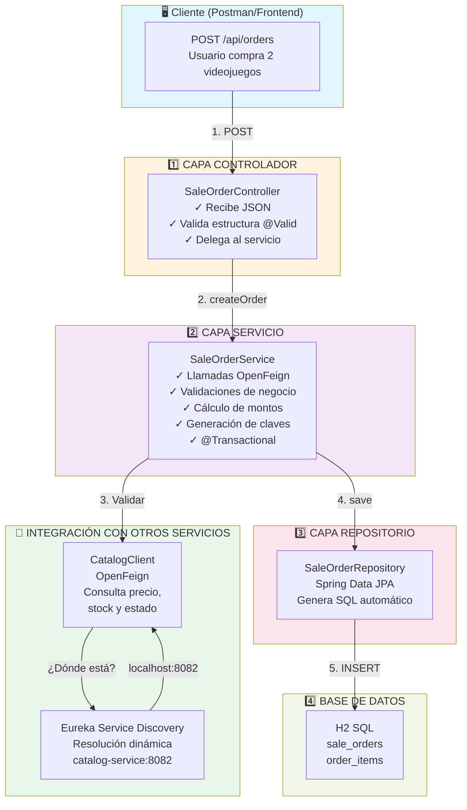
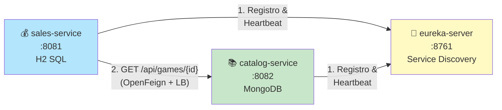
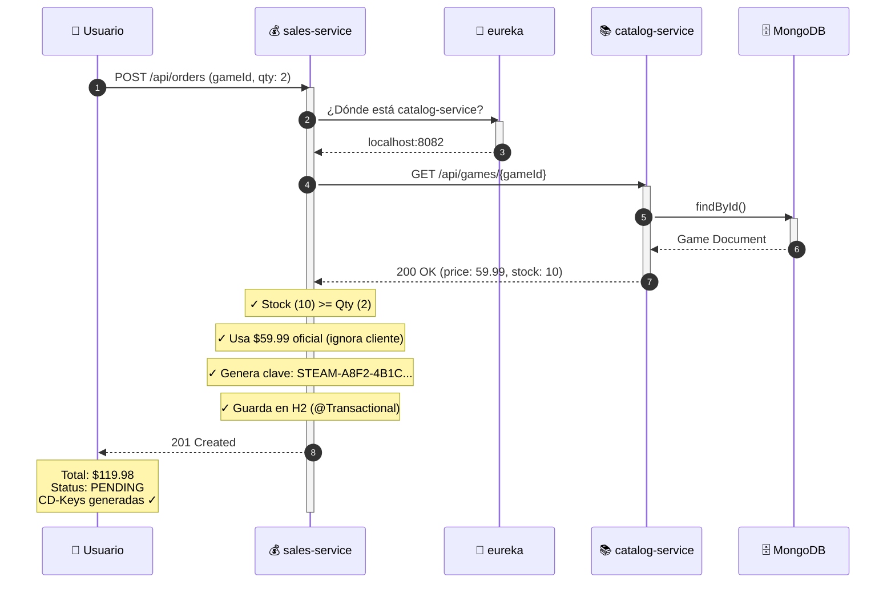
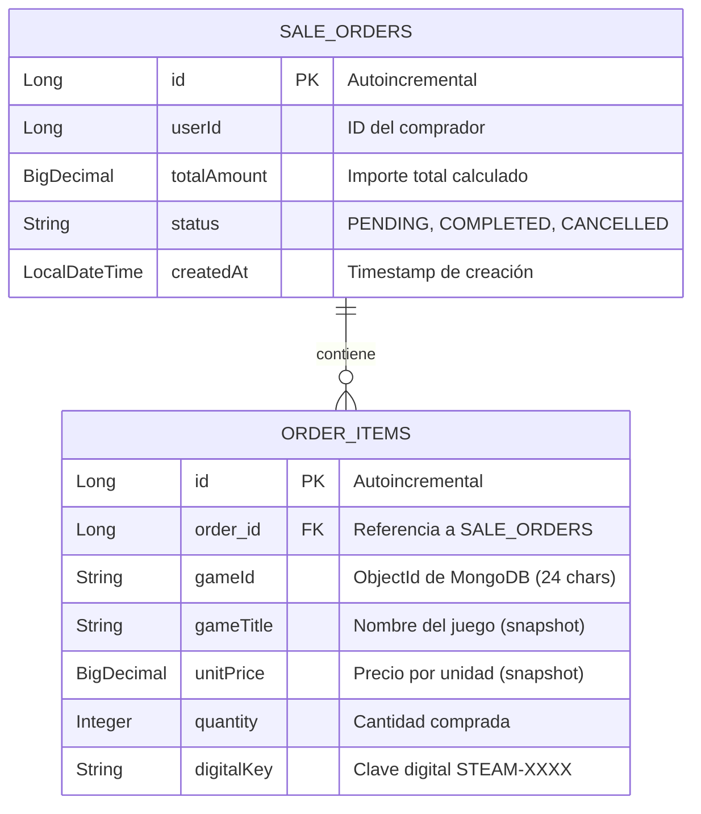

# Sales Service

> 🎮 **Microservicio de Ventas, Órdenes de Compra y Generación de Claves Digitales**  
> Construido sobre una arquitectura de microservicios con **Spring Cloud**, **OpenFeign** y **Eureka Discovery**.

<div align="center">


[Ver Ecosistema](#-ecosistema-de-microservicios) • [Quick Start](#-quick-start) • [API Reference](#-referencia-de-la-api) • [Troubleshooting](#-solución-de-problemas)

</div>

---

## 📋 Tabla de Contenidos

- [🎯 Resumen del Proyecto](#-resumen-del-proyecto)
- [🏗️ Arquitectura](#️-arquitectura)
- [🌐 Ecosistema de Microservicios](#-ecosistema-de-microservicios)
- [🔄 Flujo de Una Compra](#-flujo-de-una-compra-paso-a-paso)
- [📂 Estructura del Proyecto](#-estructura-del-proyecto)
- [📊 Modelo de Datos](#-modelo-de-datos)
- [🚀 Quick Start](#-quick-start)
- [📡 Referencia de la API](#-referencia-de-la-api)
- [✅ Guía de Pruebas](#-guía-de-pruebas)
- [🐛 Solución de Problemas](#-solución-de-problemas)
- [🔮 Mejoras Futuras](#-mejoras-futuras)
- [📝 Licencia](#-licencia)

---

## 🎯 Resumen del Proyecto

`sales-service` es el **núcleo de procesamiento de ventas** de una tienda de videojuegos distribuida. Maneja:

| Responsabilidad | Descripción |
|---|---|
| 📦 Registro de órdenes | Crea y almacena órdenes de compra con sus artículos |
| ✅ Validación contra catálogo | Consulta `catalog-service` para confirmar existencia, estado activo y stock |
| 💰 Cálculo seguro del total | Usa el **precio oficial del catálogo**, **nunca** el del cliente (blindaje anti-fraude) |
| 🔑 Generación de claves digitales | Emite claves en formato `STEAM-XXXX` por cada compra |
| 📋 Consulta y administración | Lista, busca, actualiza y elimina órdenes |

**¿Por qué existe como servicio independiente?**

Las ventas tienen ritmo de carga, reglas de negocio y requisitos de consistencia distintos al catálogo. Separarlas permite **escalarlas, desplegarlas y mantenerlas** sin afectar al resto del sistema.

---

## 🏗️ Arquitectura

### Arquitectura Interna por Capas (Clean Architecture)



### Decisiones de Arquitectura Clave

| Patrón | Justificación |
|---|---|
| **Database-per-Service** | Aislamiento total: si el catálogo falla, las ventas siguen operativas. Cada equipo controla su esquema. |
| **SQL para Ventas (H2/JPA)** | Transacciones monetarias requieren propiedades **ACID** estrictas. Una orden debe guardarse completa o no guardarse. |
| **NoSQL para Catálogo (MongoDB)** | Documentos flexibles: juegos con atributos variables (plataformas, géneros, etc.). |
| **Escalabilidad Independiente** | En Black Friday, se lanzan N instancias de `sales-service` sin gastar recursos en el catálogo. |
| **Eureka Service Discovery** | Sin direcciones IP fijas. Si hay 3 instancias de catálogo, Eureka reparte carga automáticamente. |
| **OpenFeign + Balanceo de Carga** | Interfaz declarativa, integración nativa con Eureka, código más legible. |
| **Blindaje de Precios (Anti-Fraude)** | El cliente NO controla el precio. El servidor toma el precio oficial de MongoDB, ignorando datos alterados. |

---

## 🌐 Ecosistema de Microservicios

Este servicio es **una pieza de un sistema distribuido** formado por tres repositorios independientes:



| Servicio | Puerto | BD | Rol | Repo |
|---|---|---|---|---|
| **eureka-server** | `8761` | — | Directorio de servicios (Service Discovery) | [Alger125/eureka-server](https://github.com/Alger125/eureka-server) |
| **catalog-service** | `8082` | MongoDB | Catálogo e inventario de videojuegos | [Alger125/catalog-service](https://github.com/Alger125/catalog-service) |
| **sales-service** | `8081` | H2 (SQL) | Ventas y facturación *(este repo)* | ← Aquí estamos |

### Comunicación Inter-Microservicios

#### Mapeo 1: Registro con Eureka

**Archivo:** `src/main/resources/application.properties`

```properties
spring.application.name=sales-service
server.port=8081
eureka.client.service-url.defaultZone=http://localhost:8761/eureka/
```

**Código:** `SalesServiceApplication.java`

```java
@SpringBootApplication
@EnableDiscoveryClient      // Registro automático en Eureka
@EnableFeignClients         // Escaneo de clientes Feign
public class SalesServiceApplication { ... }
```

Al arrancar:
1. Se registra bajo el nombre `SALES-SERVICE` en Eureka
2. Emite heartbeats cada 30 segundos
3. Descarga el registro de otros servicios activos

#### Mapeo 2: Consulta al Catálogo con OpenFeign

**Interfaz:** `CatalogClient.java`

```java
@FeignClient(name = "catalog-service")  // Resuelve dinámicamente via Eureka
public interface CatalogClient {
    @GetMapping("/api/games/{id}")
    GameResponse getGameById(@PathVariable("id") String id);
}
```

**DTO de Respuesta:** `GameResponse.java`

```java
public record GameResponse(
    String id,
    String title,
    String description,
    String genre,
    BigDecimal price,        // ← Precio oficial validado
    Integer stock,           // ← Stock en tiempo real
    List<String> platforms,
    Boolean active          // ← Estado de publicación
) {}
```

**Orquestación en Servicio:** `SaleOrderService.java`

```java
@Transactional
public SaleOrder createOrder(SaleOrderRequest request) {
    for (OrderItemRequest itemReq : request.items()) {
        // 1️⃣ LLAMADA REMOTA A CATÁLOGO
        GameResponse game = catalogClient.getGameById(itemReq.gameId());
        
        // 2️⃣ VALIDACIÓN DE NEGOCIO
        if (game == null || !Boolean.TRUE.equals(game.active())) {
            throw new IllegalArgumentException("Videojuego inactivo o inexistente");
        }
        
        // 3️⃣ VALIDACIÓN DE STOCK
        if (game.stock() == null || game.stock() < itemReq.quantity()) {
            throw new IllegalArgumentException("Stock insuficiente");
        }
        
        // 4️⃣ BLINDAJE DE PRECIO (anti-fraude)
        BigDecimal officialPrice = game.price();  // ← Usa precio de BD, no del cliente
        // ... resto de lógica ...
    }
}
```

---

## 🔄 Flujo de Una Compra (Paso a Paso)

Escenario: Un usuario compra 2 unidades de *Elden Ring* ($59.99 c/u)



| Paso | Qué Ocurre | Por Qué |
|---|---|---|
| 1 | Petición con `gameId` y `quantity` | Punto de entrada de la API |
| 2 | Validación de estructura (`@Valid`) | Falla rápido antes de consultar servicios externos |
| 3 | Resolución de `catalog-service` en Eureka | Evita direcciones IP fijas |
| 4 | GET `/api/games/{id}` con OpenFeign | Obtiene precio, stock y estado reales y actuales |
| 5 | Validación de existencia y estado | Impide vender juegos inactivos |
| 6 | Validación de stock (`stock >= quantity`) | Evita sobrevender |
| 7 | Cálculo con `BigDecimal` (precio oficial) | Evita errores de redondeo en dinero |
| 8 | Generación de clave digital `STEAM-XXXX` | Entrega instantánea del producto digital |
| 9 | Persistencia en transacción ACID | Todo-o-nada: garantiza consistencia |
| 10 | Respuesta con `201 Created` | Confirmación al cliente |

---

## 📂 Estructura del Proyecto

```
sales-service/
├── .mvn/wrapper/                           # Maven Wrapper
├── src/
│   ├── main/
│   │   ├── java/com/jonathan/gamestore/sales/
│   │   │   ├── SalesServiceApplication.java      # Punto de entrada
│   │   │   ├── client/
│   │   │   │   └── CatalogClient.java            # OpenFeign → catalog-service
│   │   │   ├── config/
│   │   │   │   └── H2Config.java                 # Servlet de consola H2
│   │   │   ├── controller/
│   │   │   │   └── SaleOrderController.java      # REST API /api/orders
│   │   │   ├── dto/
│   │   │   │   ├── SaleOrderRequest.java         # Request de entrada
│   │   │   │   ├── OrderItemRequest.java         # Item de orden
│   │   │   │   └── GameResponse.java             # Respuesta del catálogo
│   │   │   ├── model/
│   │   │   │   ├── SaleOrder.java                # Entidad raíz (sale_orders)
│   │   │   │   ├── OrderItem.java                # Entidad detalle (order_items)
│   │   │   │   └── OrderStatus.java              # Enum: PENDING, COMPLETED, CANCELLED
│   │   │   ├── repository/
│   │   │   │   └── SaleOrderRepository.java      # Spring Data JPA
│   │   │   ├── service/
│   │   │   │   └── SaleOrderService.java         # Lógica de negocio
│   │   │   └── exception/
│   │   │       ├── ErrorResponse.java            # Estructura estándar de error
│   │   │       └── GlobalExceptionHandler.java   # @RestControllerAdvice
│   │   └── resources/
│   │       └── application.properties            # Configuración
│   └── test/                                     # Pruebas automatizadas
├── mvnw / mvnw.cmd                             # Scripts Maven Wrapper
├── pom.xml                                      # Dependencias Maven
└── README.md                                    # Este archivo
```

### Componentes Principales

| Componente | Tipo | Responsabilidad |
|---|---|---|
| `SalesServiceApplication` | Main | Punto de entrada; activa `@EnableDiscoveryClient` y `@EnableFeignClients` |
| `SaleOrderController` | REST | API `/api/orders`; valida estructura con `@Valid` |
| `SaleOrderService` | Service | Orquesta validaciones, cálculos y llamadas a OpenFeign |
| `CatalogClient` | Feign | Interfaz declarativa HTTP hacia `catalog-service` |
| `SaleOrderRepository` | JPA | Acceso a datos SQL; genera consultas automáticas |
| `SaleOrder` / `OrderItem` | Entity | Entidades JPA mapeadas a `sale_orders` y `order_items` |
| `GlobalExceptionHandler` | Advice | Centraliza errores en estructura estándar |

---

## 📊 Modelo de Datos



### Decisiones de Diseño

- **`gameId` es `String`**: MongoDB usa ObjectIds de 24 caracteres
- **Sin clave foránea hacia catálogo**: Viven en BDs diferentes
- **`gameTitle` y `unitPrice` desnormalizados**: Se guardan en el ítem para preservar el precio y nombre del momento de la compra, aunque el catálogo cambie después
- **Cascada `@OneToMany(cascade = ALL, orphanRemoval = true)`**: Guardar o eliminar una orden afecta también a sus artículos

---

## 🚀 Quick Start

### Requisitos Previos

| Requisito | Versión | Verificar |
|---|---|---|
| JDK | 17+ | `java -version` |
| Git | Cualquiera | `git --version` |
| Maven | No es necesario (se incluye Maven Wrapper) | — |

### Orden de Arranque (Crítico)

⚠️ **IMPORTANTE:** Los servicios deben iniciarse en este orden:

```
1. eureka-server (Directorio de servicios)
    ↓
2. catalog-service (Catálogo de juegos)
    ↓
3. sales-service (Gestión de ventas)
```

Si inicias `sales-service` primero, intentará conectar a `catalog-service` y fallará.

### Paso 1: Clonar el Repositorio

```bash
git clone https://github.com/Alger125/sales-service.git
cd sales-service
```

### Paso 2: Iniciar Eureka Server

En una **primera terminal**:

```bash
cd ../eureka-server
./mvnw spring-boot:run          # Linux/macOS
# o
.\mvnw.cmd spring-boot:run      # Windows
```

✅ **Verificar:** Abre `http://localhost:8761` en el navegador. Deberías ver el Dashboard de Eureka vacío.

### Paso 3: Iniciar Catalog Service

En una **segunda terminal**:

```bash
cd ../catalog-service
./mvnw spring-boot:run
```

⏳ Espera 5 segundos. ✅ **Verificar:** En Eureka aparecerá `CATALOG-SERVICE` con estado `UP`.

**Requisito:** MongoDB debe estar corriendo en `localhost:27017`

### Paso 4: Iniciar Sales Service

En una **tercera terminal**:

```bash
cd ../sales-service
./mvnw spring-boot:run
```

⏳ Espera 5 segundos. ✅ **Verificar:** En Eureka aparecerá `SALES-SERVICE` con estado `UP`.

### Alternativa Rápida: Ejecutar JAR Compilado

```bash
./mvnw clean package -DskipTests
java -Xmx300m -jar target/sales-service-0.0.1-SNAPSHOT.jar
```

- `-DskipTests`: Omite pruebas (más rápido)
- `-Xmx300m`: Limita RAM a 300 MB (útil en máquinas con 8 GB)

### Accesos Útiles

| Componente | URL |
|---|---|
| **Sales Service API** | `http://localhost:8081/api/orders` |
| **Consola H2** | `http://localhost:8081/h2-console` |
| **Eureka Dashboard** | `http://localhost:8761` |
| **Catalog Service API** | `http://localhost:8082/api/games` |

---

## 📡 Referencia de la API

**URL Base:** `http://localhost:8081/api/orders`

### Endpoints

| Operación | Método | Ruta | Descripción | Éxito | Errores |
|---|---|---|---|---|---|
| **Crear orden** | `POST` | `/api/orders` | Registra una orden validando en catálogo | `201` | `400`, `404` |
| **Listar todas** | `GET` | `/api/orders` | Retorna todas las órdenes | `200` | `500` |
| **Consultar por ID** | `GET` | `/api/orders/{id}` | Retorna una orden específica | `200` | `404` |
| **Consultar por usuario** | `GET` | `/api/orders/user/{userId}` | Filtra órdenes de un usuario | `200` | — |
| **Actualizar** | `PUT` | `/api/orders/{id}` | Actualiza orden recalculando montos | `200` | `400`, `404` |
| **Eliminar** | `DELETE` | `/api/orders/{id}` | Elimina orden y detalles en cascada | `204` | `404` |

### Ejemplo: Crear una Orden

#### Request

```http
POST /api/orders
Content-Type: application/json

{
  "userId": 101,
  "items": [
    {
      "gameId": "650c1f1e9b1d8b2bad000001",
      "gameTitle": "Elden Ring",
      "unitPrice": 59.99,
      "quantity": 2
    }
  ]
}
```

#### Response `201 Created`

```json
{
  "id": 1,
  "userId": 101,
  "totalAmount": 119.98,
  "status": "PENDING",
  "createdAt": "2026-09-30T10:15:00",
  "items": [
    {
      "id": 1,
      "gameId": "650c1f1e9b1d8b2bad000001",
      "gameTitle": "Elden Ring",
      "unitPrice": 59.99,
      "quantity": 2,
      "digitalKey": "STEAM-A8F2-4B1C-D9E3-F7G2"
    }
  ]
}
```

### Manejo de Errores

`GlobalExceptionHandler` centraliza todas las respuestas de error.

| Situación | Excepción | HTTP | Ejemplo |
|---|---|---|---|
| Validación fallida | `MethodArgumentNotValidException` | `400` | Falta `userId` o `quantity` negativa |
| Regla de negocio | `IllegalArgumentException` | `400` | Stock insuficiente, juego inactivo |
| Juego no encontrado | Error 404 de Feign | `404` | `gameId` inexistente |
| Error del servidor | `Exception` | `500` | Error no controlado |

**Estructura de Error Estándar:**

```json
{
  "status": 400,
  "error": "Bad Request",
  "message": "Stock insuficiente para: Elden Ring",
  "validationErrors": null,
  "timestamp": "2026-09-30T10:15:00"
}
```

---

## ✅ Guía de Pruebas

### Escenario Completo (End-to-End)

#### 1️⃣ Crear un Videojuego en Catálogo

<details open>
<summary><b>cURL</b></summary>

```bash
curl -X POST http://localhost:8082/api/games \
  -H "Content-Type: application/json" \
  -d '{
    "title": "Elden Ring",
    "description": "Edición Estándar",
    "genre": "RPG",
    "price": 59.99,
    "stock": 10,
    "platforms": ["PC", "PS5"]
  }'
```

</details>

<details>
<summary><b>PowerShell</b></summary>

```powershell
$gameResponse = Invoke-RestMethod -Uri "http://localhost:8082/api/games" -Method Post `
  -ContentType "application/json" `
  -Body '{
    "title": "Elden Ring",
    "description": "Edición Estándar",
    "genre": "RPG",
    "price": 59.99,
    "stock": 10,
    "platforms": ["PC", "PS5"]
  }'

$gameId = $gameResponse.id
Write-Host "✓ Juego creado con ID: $gameId"
```

</details>

**Respuesta esperada:** `201 Created` con `id` del juego (guarda este ID)

---

#### 2️⃣ Crear una Orden de Compra

<details open>
<summary><b>cURL</b></summary>

```bash
GAME_ID="650c1f1e9b1d8b2bad000001"  # Sustituir con el ID del paso anterior

curl -X POST http://localhost:8081/api/orders \
  -H "Content-Type: application/json" \
  -d "{
    \"userId\": 101,
    \"items\": [
      {
        \"gameId\": \"$GAME_ID\",
        \"gameTitle\": \"Elden Ring\",
        \"unitPrice\": 59.99,
        \"quantity\": 2
      }
    ]
  }"
```

</details>

<details>
<summary><b>PowerShell</b></summary>

```powershell
Invoke-RestMethod -Uri "http://localhost:8081/api/orders" -Method Post `
  -ContentType "application/json" `
  -Body @"
{
  "userId": 101,
  "items": [
    {
      "gameId": "$gameId",
      "gameTitle": "Elden Ring",
      "unitPrice": 59.99,
      "quantity": 2
    }
  ]
}
"@ | ConvertTo-Json -Depth 5
```

</details>

**Resultado esperado:**
- ✅ HTTP `201 Created`
- ✅ `totalAmount`: `119.98`
- ✅ `status`: `PENDING`
- ✅ Claves digitales generadas: `STEAM-XXXX-XXXX-XXXX-XXXX`

---

#### 3️⃣ Listar Todas las Órdenes

<details open>
<summary><b>cURL</b></summary>

```bash
curl http://localhost:8081/api/orders
```

</details>

<details>
<summary><b>PowerShell</b></summary>

```powershell
Invoke-RestMethod -Uri "http://localhost:8081/api/orders" | ConvertTo-Json -Depth 10
```

</details>

---

#### 4️⃣ Consultar Órdenes de un Usuario

<details open>
<summary><b>cURL</b></summary>

```bash
curl http://localhost:8081/api/orders/user/101
```

</details>

<details>
<summary><b>PowerShell</b></summary>

```powershell
Invoke-RestMethod -Uri "http://localhost:8081/api/orders/user/101" | ConvertTo-Json -Depth 10
```

</details>

---

#### 5️⃣ Eliminar una Orden

<details open>
<summary><b>cURL</b></summary>

```bash
curl -X DELETE http://localhost:8081/api/orders/1 -i
```

</details>

<details>
<summary><b>PowerShell</b></summary>

```powershell
Invoke-WebRequest -Uri "http://localhost:8081/api/orders/1" -Method Delete
```

</details>

**Resultado esperado:** `204 No Content`

---

### Pruebas de Casos Negativos (Recomendadas)

| Caso | Cómo | Resultado Esperado |
|---|---|---|
| **Stock insuficiente** | `quantity` > `stock` del juego | `400` con mensaje de stock |
| **Juego inexistente** | `gameId` que no existe | `404` |
| **Validación fallida** | `items` vacío o sin `userId` | `400` con `validationErrors` |
| **Manipulación de precio** | Enviar `unitPrice: 0.01` | Total se calcula con precio oficial, no con `0.01` ✓ |
| **Catálogo caído** | Detener `catalog-service` y crear orden | Error controlado de conexión |

---

## 🐛 Solución de Problemas

### Problema: `Connection refused` a `localhost:8761`

**Causa:** Eureka Server no está iniciado.

**Solución:**
```bash
cd ../eureka-server
./mvnw spring-boot:run
```

---

### Problema: `Load balancer does not have available server`

**Causa:** `catalog-service` no se ha registrado en Eureka todavía.

**Solución:** Espera 5 segundos y verifica en `http://localhost:8761` que `CATALOG-SERVICE` esté con estado `UP`.

---

### Problema: `404` al crear orden

**Causa:** El `gameId` no existe en MongoDB.

**Solución:** Crea un juego en `catalog-service` y usa el `id` devuelto:

```bash
curl -X POST http://localhost:8082/api/games \
  -H "Content-Type: application/json" \
  -d '{"title":"Game Name","price":29.99,"stock":5,"genre":"RPG"}'
```

---

### Problema: Puerto `8081` ocupado

**Causa:** Otro proceso usa el puerto.

**Solución:** Cambia el puerto en `application.properties`:

```properties
server.port=8085
```

O mata el proceso:

```bash
# Linux/macOS
lsof -ti:8081 | xargs kill -9

# Windows
netstat -ano | findstr :8081
taskkill /PID <PID> /F
```

---

### Problema: Los datos desaparecen al reiniciar

**Causa:** H2 es **en memoria** (`jdbc:h2:mem:salesdb`).

**Comportamiento:** Esperado en desarrollo. Para producción, usa PostgreSQL, MySQL o similar.

---

### Problema: `OutOfMemoryError`

**Causa:** Poca RAM disponible.

**Solución:** Ajusta `-Xmx`:

```bash
java -Xmx500m -jar target/sales-service-0.0.1-SNAPSHOT.jar
```

O cierra otras aplicaciones.

---

### Problema: `Hystrix CircuitBreaker is open`

**Causa:** Demasiadas llamadas fallidas a `catalog-service`.

**Solución:** Verifica que `catalog-service` esté activo y en `http://localhost:8761`.

---

## 🔮 Mejoras Futuras

Puntos identificados para fortalecer el servicio:

### 1. **Resiliencia (Circuit Breaker, Retry, Timeout)**
```java
// Usar Resilience4j
@CircuitBreaker(name = "catalogService")
@Retry(name = "catalogService")
@Timeout(name = "catalogService")
GameResponse getGameById(String id) { ... }
```

### 2. **Descuento de Stock Automático**
- Definir cuándo y cómo se reduce el inventario en MongoDB
- Manejar race conditions (dos compras por la última unidad)

### 3. **Mensajería Asíncrona (Kafka)**
El `pom.xml` ya incluye `spring-boot-starter-kafka`:

```java
@KafkaListener(topics = "sales-events")
void handleOrderCreated(OrderCreatedEvent event) { ... }

kafkaTemplate.send("sales-events", new OrderCreatedEvent(...));
```

### 4. **Configuración Centralizada (Spring Cloud Config)**
Ya está en `pom.xml`. Conectar a `spring-cloud-config-server`.

### 5. **Persistencia Real (PostgreSQL/MySQL)**
Reemplazar H2 en memoria:

```xml
<dependency>
    <groupId>org.springframework.boot</groupId>
    <artifactId>spring-boot-starter-data-jpa</artifactId>
</dependency>
<dependency>
    <groupId>org.postgresql</groupId>
    <artifactId>postgresql</artifactId>
</dependency>
```

### 6. **Seguridad (JWT / OAuth2)**
Agregar autenticación para no depender de que el cliente indique su `userId`:

```java
@Bean
public SecurityFilterChain filterChain(HttpSecurity http) { ... }
```

### 7. **Documentación Interactiva (Swagger/OpenAPI)**
```xml
<dependency>
    <groupId>org.springdoc</groupId>
    <artifactId>springdoc-openapi-starter-webmvc-ui</artifactId>
    <version>2.0.2</version>
</dependency>
```

Accesible en `http://localhost:8081/swagger-ui.html`

### 8. **Pruebas Automatizadas**
- Unitarias (mockeando `CatalogClient`)
- Integración (`@SpringBootTest`)
- End-to-End (Testcontainers)

### 9. **Contenedores (Docker)**
```dockerfile
FROM openjdk:17-slim
COPY target/sales-service-*.jar app.jar
ENTRYPOINT ["java","-Xmx300m","-jar","app.jar"]
```

```yaml
# docker-compose.yml
services:
  eureka-server:
    image: eureka-server
    ports: ["8761:8761"]
  
  catalog-service:
    image: catalog-service
    ports: ["8082:8082"]
    depends_on: [eureka-server]
  
  sales-service:
    image: sales-service
    ports: ["8081:8081"]
    depends_on: [eureka-server, catalog-service]
```

### 10. **Observabilidad (Logs, Métricas, Trazas)**
- **Logs estructurados:** SLF4J + Logback
- **Métricas:** Spring Boot Actuator + Prometheus
- **Trazabilidad distribuida:** Sleuth + Zipkin

---

## 📝 Licencia

Este proyecto está bajo la licencia **MIT**. Consulta el archivo `LICENSE` para más detalles.

---

## 🤝 Contribuciones

Las contribuciones son bienvenidas. Por favor:

1. Fork el repositorio
2. Crea una rama para tu feature (`git checkout -b feature/amazing-feature`)
3. Haz commit de tus cambios (`git commit -m 'Add amazing feature'`)
4. Push a la rama (`git push origin feature/amazing-feature`)
5. Abre un Pull Request

---

## 📚 Recursos Adicionales

- [Spring Boot Documentation](https://spring.io/projects/spring-boot)
- [Spring Cloud Netflix Eureka](https://spring.io/projects/spring-cloud-netflix)
- [Spring Cloud OpenFeign](https://spring.io/projects/spring-cloud-openfeign)
- [Spring Data JPA](https://spring.io/projects/spring-data-jpa)
- [H2 Database](https://www.h2database.com/)

---

<div align="center">

**Hecho con ❤️ por [Alger125](https://github.com/Alger125)**

[⬆ Volver al inicio](#sales-service)

</div>
